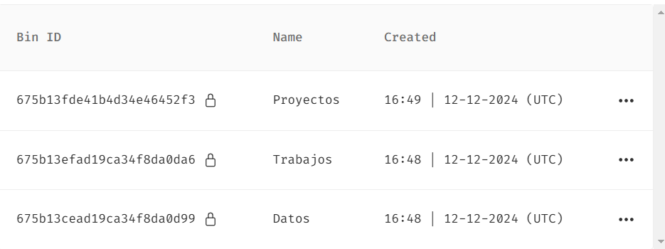
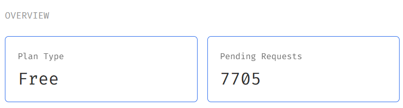
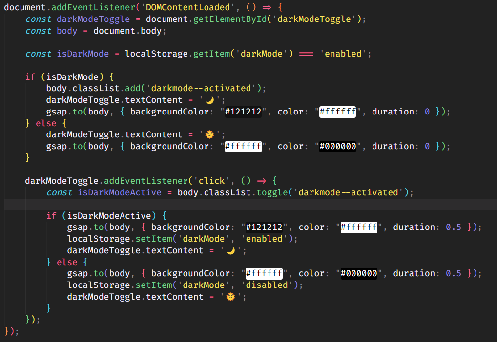
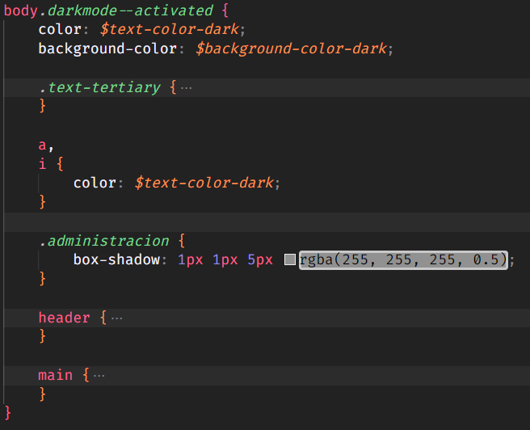
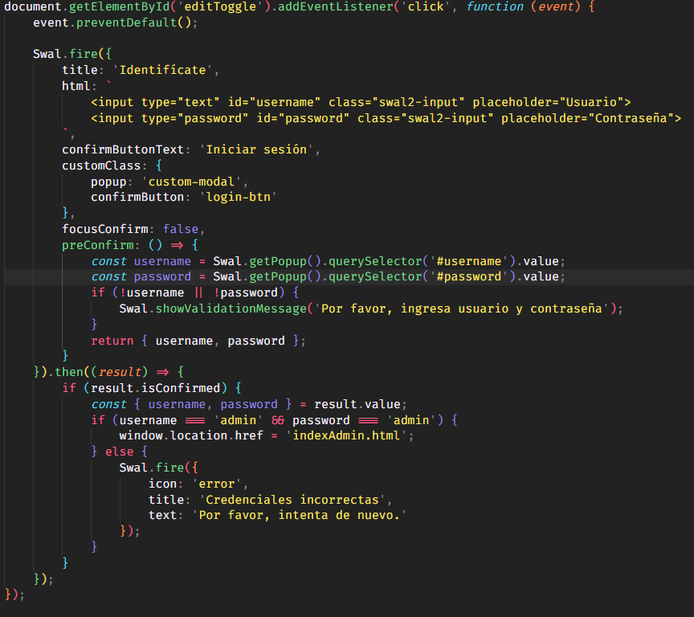
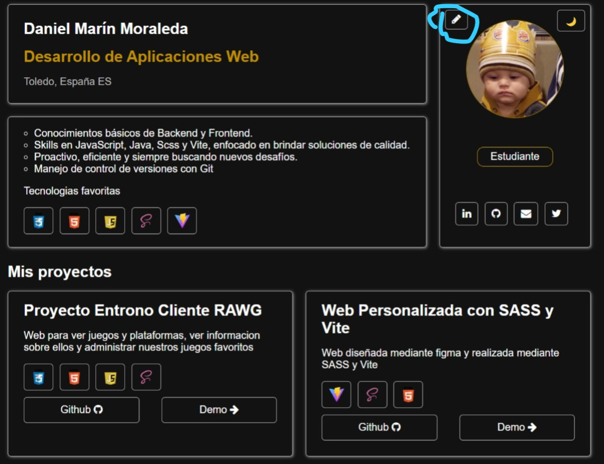
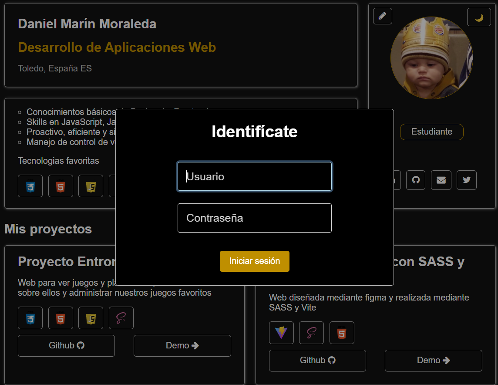

# Proyecto Final Integral - Portfolio

> [!NOTE]  
> Claves administrador
- Usuario: admin
- Contraseña: admin

## Enlaces

- **Repositorio en GitHub**: [portfolioDanielMarmo](https://github.com/danielMarmo/portfolioDanielMarmo)
- **Demo en Vivo**: [Ver Proyecto](https://danielmarmo.github.io/portfolioDanielMarmo)

## Tecnologías Utilizadas

- **HTML5**: Estructura y contenido básico del sitio web.
- **CSS**: Estilización visual de las páginas.
- **SASS**: Preprocesador CSS para organizar y mejorar el código de estilo.
- **JavaScript**: Para la lógica y la interactividad del sitio.
- **JSONbin.io**: Servicio de almacenamiento remoto para los datos del portfolio.
- **Vite**: Herramienta de construcción para mejorar el flujo de trabajo de desarrollo.

## Características

- **Página de inicio**: En la que esta el portfolio con un diseño simple
- **Administración**: Se incluye un modo administrador para editar y actualizar la información del perfil y los proyectos, para accedera este modo hay que pulsar en el boton de editar situado en la pagina de inicio, no solicitara un usuario y contraseña.
- **Diseño Responsivo**: El diseño es completamente responsivo, adaptándose a dispositivos móviles y de escritorio.
- **Almacenamiento de datos**: Los datos se almacenan de forma remota en un archivo JSON hosteado en jsonbin.io.

## Descripción

Este es el **Portfolio** que he realizado para la Práctica 3.2.
He optado por un diseño simple y minimalista, pero decidí crear una interfaz gráfica para editar los datos del portfolio, puede que esto este mas enfocado a desarrollo back mas que a desarrollo front, pero ha sido mi idea y he seguido con ella.

Para poder llevar esto acabo he tenido que almacenar los datos en un json, que estan hosteados en jsonbin.io, que es una pagina que te permite hostear json, el plan free tiene un limite de 10.000 peticiones, mientras he realizado la práctica he realizado aproximadamente 2,500 peticiones, por lo que todavía quedan bastantes disponibles, esto lo hice para poder desplegar la web en GitHub Pages y seguir editándola, ya que si los json estan en local no se pueden actualizar en el repositorio

Tengo creados 3 json, lo que hace que haga mas peticiones pero me facilito la implementacion de la interfaz grafica, ya que cuando queria modificar o insertar un proyecto al sobreescribirlo perdia los datos del usuario y de los trabajos, asi que opte por realizar un json para cada apartado

Actualmente quedan bastantes peticiones free

## Modo oscuro

He implementado tambien un boton para cambiar el tema de nuestra web, esto se almacena en el navegador, por lo que si cierras la web y la vuelves a abrir en otro momento seguira en el ultimo tema que dejaste configurado

Para realizar esto estuve investigando varias opciones, probe a usar una libreria javascript pero me estaba dando muchos problemas para cambiar el color de algunas cosas asi que finalmente opte por hacerlo con css manualmente

Para lograrlo, tengo un archivo JavaScript que hace que al hacer click en el boton incluya la clase **darkmode--activated** en el body de la web

Y despues mediante CSS se adaptan los colores que necesitamos cambiar

## Librerias
He usado varias librerias, para dar animaciones, seguridad y diseño
> Libreria de seguridad
- https://cdn.jsdelivr.net/npm/sweetalert2@11

Esta libreria la he añadido en la pagina principal, su funcionamiento consiste en solicitar un usuario y una contraseña, en este caso admin y admin, pero solo nos solicitara esta verificacion cuando demos click en un enlace que nos redireccione a indexAdmin.html

Esto esta configurado en el archivo admin.js

Lo normal no seria almacenar el usuario y la contraseña de esta forma, seria mejor cifrar estos datos para que la gente no pueda acceder a ellos, pero no me da tiempo a investigar sobre ello y cambiarlo

> Libreria de animaciones - GASP
- https://cdnjs.cloudflare.com/ajax/libs/gsap/3.12.2/gsap.min.js

La he utilizado para dar una pequeña animacion cuando pasamos de darkMode al modo por defecto, esta configuracion esta ya realizada en el mismo archivo donde añadimos la clase **darkmode--activated** en el body

> Libreria de diseño para los formularios - Materialize
- https://cdnjs.cloudflare.com/ajax/libs/materialize/1.0.0/js/materialize.min.js

La he usado para dar un pequeño diseño mas llamativo a los formularios para editar la informacion

## Funcionamiento

La pagina inicia en la pagina principal donde se muestra el portfolio
Cuando damos click en el siguiente boton:

Nos saltara un formulario para rellenar

Y nos llevara al panel de administrador, que es exactamente igual a la pagina principal, pero que añade botones de editar, en proyectos y trabajos nos llevara a un formulario para añadir uno nuevo, pero tambien tenemos la posibilidad de editar o eliminar uno que ya existe, mediante unos botones que saldran en cada card

Editar el perfil es similar, solo que cuando accedamos los datos ya estaran puestos en el formulario

## Cosas a mejorar
- La foto de perfil solo se puede poner una foto con una url de internet, no es posible elegir una imagen que tengamos en nuestro dispositivo
- Nuestra web es un poco lenta, ya que tiene que contactar con los json hosteados para darnos la informacion
- Siendo realistas es posible que esta web no sea lo mas indicado para esta práctica, ya que estamos en la asignatura de diseño, y yo he dejado un diseño bastante simple aunque añadiendo algunas animaciones y funcionalidades, pero me he centrado mas en un funcionamiento "back" de la web.
La veo muy completa pero alomejor no es lo que deberia de haber hecho

